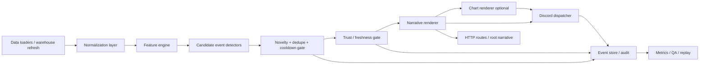

# 01 Architecture

## Goal

Build a backend service that continuously analyzes your market data and pushes **high-signal events** to Discord with:

- decorated text
- optional charts
- structured machine facts
- confidence and trust labels
- educational notes
- minimal noise

## High-level architecture

## Component responsibilities

### 1. Normalization layer
Purpose:
- align raw tables to a stable internal shape
- enforce timestamps, symbols, expiries, and units
- compute session-relative fields such as:
  - return vs prior close
  - return vs session open
  - return vs VWAP
  - range % of day
  - percentile vs rolling history

Design notes:
- never let downstream detectors read raw source tables directly
- all entity identifiers should be canonicalized
- all numeric fields should carry units in metadata

### 2. Feature engine
Purpose:
- compute analysis-ready features every minute or on each batch refresh

Core feature groups:

#### Market state
- index return
- gap return
- breadth up %
- breadth above VWAP %
- breadth above ORH / below ORL %
- weighted participation %
- top-10 concentration %
- dispersion %
- sign agreement %
- realized intraday volatility
- drawdown from day high
- climb from day low

#### Stock state
- last
- change %
- residual return vs index
- daily RSI14
- intraday RSI14
- VWAP deviation %
- time above VWAP %
- volume ratio
- range efficiency
- relative strength persistence
- continuation score
- reversal score
- mean-reversion score
- catch-up score
- risk flags

#### Options structure
- spot
- weekly PCR
- monthly PCR
- ATM IV
- skew
- call wall
- put wall
- wall migration
- max pain weekly
- max pain monthly
- distance spot to max pain
- OI concentration
- OI delta concentration

#### Institutional / post-close
- FII index futures long %
- FII stock futures long %
- client index futures long %
- prop long %
- day-over-day change
- percentile vs rolling history
- spread FII vs client
- supportive / contrarian / stretched classification

#### Trust / quality
- freshness by source
- expected-vs-seen symbols
- missing bars
- partial updates
- parser health
- source lag

### 3. Candidate event detectors
Purpose:
- turn features into candidate events
- detectors should be deterministic and independently testable

Recommended detector groups:
- market regime shift
- volatility shock
- breadth failure
- narrow leadership warning
- broad participation confirmation
- late reversal
- stock true leader
- stock false leader
- stock breakdown
- stock reversal
- options wall shift
- max pain pin risk
- options confirms spot
- options contradicts spot
- FII regime shift (post-close)
- event catalyst escalation
- data quality degradation

### 4. Novelty / dedupe / cooldown gate
Purpose:
- prevent spam
- ensure Discord gets meaning, not raw churn

Rules:
- every candidate event gets:
  - `dedupe_key`
  - `entity_key`
  - `severity_score`
  - `novelty_score`
  - `cooldown_policy`
  - `confirmation_count`
- alert fires only if:
  - severity above threshold
  - novelty above threshold
  - trust not below minimum
  - no active cooldown unless severity escalates materially
- maintain state:
  - last sent event per dedupe key
  - last sent metric values
  - last sent severity
  - last sent timestamp
  - current active market regime

### 5. Trust gate
Purpose:
- suppress or downgrade alerts when data is stale, partial, or contradictory because of missing inputs

Hard rules:
- if quote freshness > threshold, suppress live market alerts
- if option chain is stale, suppress options-confirmation language
- if breadth universe coverage drops below minimum, relabel to partial
- if FII report is not current session, label as latest official daily report
- if source schema mismatch occurs, suppress affected module and send ops alert

### 6. Narrative renderer
Purpose:
- convert structured facts into:
  - Discord-ready decorated text
  - embed fields
  - LLM-readable brief
  - machine facts block
  - learner notes

Important:
- the renderer must never invent values
- every conclusion must cite the underlying metrics in payload form

### 7. Chart renderer
Purpose:
- add a compact PNG chart only when it adds meaning

Recommended chart policies:
- attach chart for:
  - market shock
  - breadth failure
  - true leader
  - options wall shift
  - close summary
- skip chart for:
  - low-severity ops alerts
  - repeated follow-ups where chart is unchanged
- chart cards must remain interpretable if the image fails to load

### 8. Discord dispatcher
Purpose:
- deliver webhook messages reliably with backoff and observability

Rules:
- send using webhook execution endpoint
- use `wait=true` for staging / verification mode
- set `allowed_mentions.parse=[]`
- parse rate-limit headers
- retry on 429 using `Retry-After`
- treat 404 webhook as terminal and stop retrying
- keep payloads under Discord size limits

### 9. Event store / audit
Store:
- raw candidate event
- suppression reason if not sent
- final rendered message
- chart hash
- Discord response metadata
- delivery status
- operator feedback
- replay labels

### 10. HTTP routes
Provide a small HTTP surface even if Discord is the primary consumer:
- `/`
- `/api/stream/now`
- `/api/events/recent`
- `/api/events/{id}`
- `/api/health`
- `/api/quality`
- `/api/dispatch/preview`
- `/api/dispatch/test`

## Recommended deployment topology

### Core services
1. **ingest-sync**
   - watches data refreshes or polls relevant tables
2. **feature-service**
   - computes minute and daily feature views
3. **alert-engine**
   - runs detectors + novelty + cooldown + trust gate
4. **render-service**
   - creates narrative + chart + machine facts
5. **dispatch-service**
   - posts to Discord
6. **api-service**
   - exposes root narrative and APIs

### Storage
- PostgreSQL for durable features, event history, audit
- Redis for hot state:
  - last alert per key
  - cooldown timers
  - minute snapshots
  - short-lived chart cache

## Data cadence guidance

### Every minute
- quote-based features
- breadth
- stock leadership
- volatility
- market regime
- top/bottom movers
- session drawdown / recovery
- intraday options structure if available and compliant

### Every 5 minutes
- heavier chart generation
- digest snapshots
- broader cross-sectional ranking
- quality rollups

### After each official post-close report
- FII / participant context
- end-of-day setup updates
- daily summary
- next-session plan

## Message classes

1. **High-priority event**
   - market break
   - volatility shock
   - options structure change
   - data-quality incident
2. **Medium-priority insight**
   - leader rotation
   - sector rotation
   - strong stock setup
3. **Scheduled digest**
   - open + 30m
   - mid-session
   - pre-close
   - close summary
4. **Post-close context**
   - FII / participant flow
   - daily setup board
   - event calendar summary

## Root-route narrative

The root route should return:
- decorated header
- latest market dossier
- key conclusions
- leaders and laggards
- volatility / options / FII / breadth snapshot
- data quality
- machine facts block for LLMs

## Success criteria

- signal-to-noise is clearly positive
- duplicate alerts are rare
- data-quality degradation is visible
- messages are numerically grounded
- charts are additive, not decorative only
- Discord remains readable during fast markets
