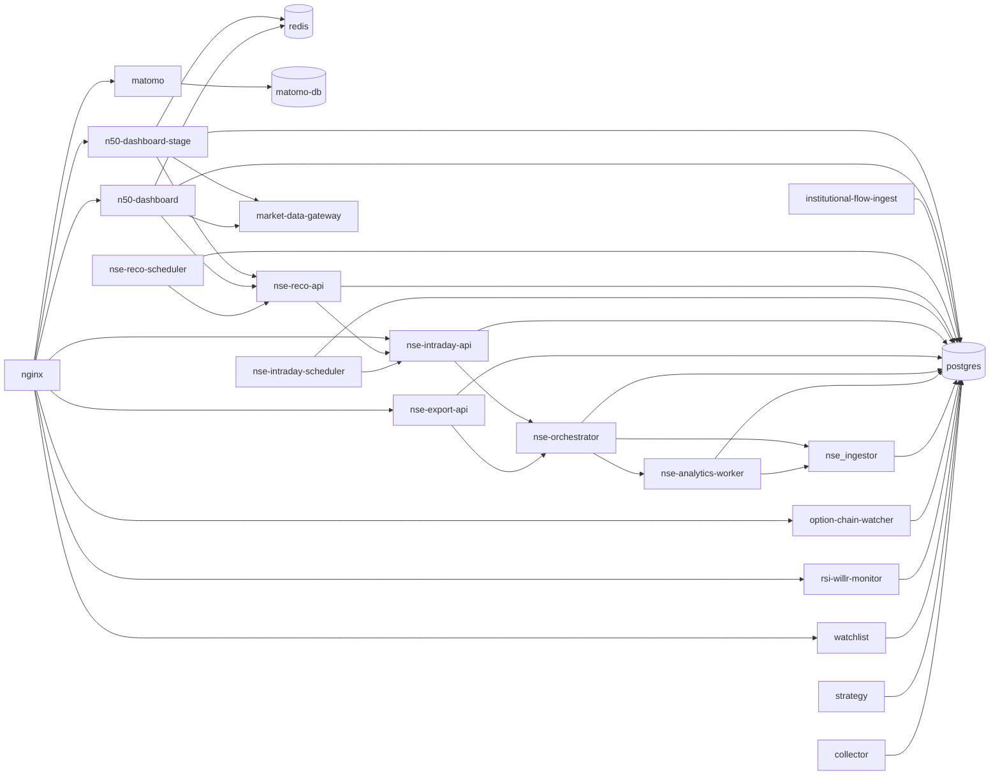

# Service Dependency Map

Last reviewed: 2026-04-03

This file captures the current runtime dependency graph and the main build-codebase clusters that exist before any compose decomposition work.

## Runtime Dependency Graph

## Dependency Notes

- The current edge container depends on both production and stage dashboards plus legacy watchlist routes and Matomo. That makes nginx part of the current prod, stage, telemetry, and legacy blast radius at the same time.
- `n50-dashboard` and `n50-dashboard-stage` are not standalone frontends. Both depend on `postgres`, `redis`, `nse-reco-api`, and `market-data-gateway`.
- The dashboard does not call `nse-export-api` or `nse-intraday-api` directly from the browser. It proxies those backends through the dashboard API server, which preserves same-origin routing under `/n50/api/v1/*`.
- `nse-orchestrator`, `nse-export-api`, `nse-intraday-api`, and `nse-intraday-scheduler` form a chain with several `service_started` dependencies instead of health-gated readiness.
- `nse-reco-scheduler` is currently the most obvious runtime instability candidate because the active stack snapshot shows it in a restart loop while its dependency is only `service_started`.

## Build-Codebase Clusters

### Cluster A: root Go image

One repo-root `Dockerfile` is reused across:

- `collector`
- `strategy`
- `watchlist`
- `rsi-willr-monitor`

Current implication:

- one codebase artifact exists logically, but the compose file still asks Docker to build it repeatedly from the repo root.

### Cluster B: orchestration/exports image

Shared repo-root build context and Dockerfile:

- `nse-orchestrator`
- `nse-export-api`

Dockerfile:

- [`services/nse_orchestration_exports/docker/Dockerfile`](../../services/nse_orchestration_exports/docker/Dockerfile)

### Cluster C: intraday intelligence image

Shared repo-root build context and Dockerfile:

- `nse-intraday-api`
- `nse-intraday-scheduler`

Dockerfile:

- [`services/nse_intraday_intelligence/docker/Dockerfile`](../../services/nse_intraday_intelligence/docker/Dockerfile)

### Cluster D: reco engine image

Shared local build context:

- `nse-reco-api`
- `nse-reco-scheduler`

Dockerfile:

- [`services/nse_reco_state_engine/Dockerfile`](../../services/nse_reco_state_engine/Dockerfile)

### Cluster E: dashboard image family

Shared local build context:

- `n50-dashboard`
- `n50-dashboard-stage`

Current difference:

- different Vite base-path/build args (`/n50/` vs `/n50-stage/`) and different runtime env.

## Root Build Contexts To Track

The following services currently send the repo root as Docker build context:

- `collector`
- `strategy`
- `watchlist`
- `rsi-willr-monitor`
- `nse-orchestrator`
- `nse-export-api`
- `nse-intraday-api`
- `nse-intraday-scheduler`

These are the highest-value build-optimization candidates for Phase 3 because repo-root contexts are most likely to drag in unrelated files and duplicate work.

## Default Split Recommendation For Later Phases

This is a baseline categorization only. It is not a removal plan.

- Core: `postgres`, `redis`, `nginx`, `option-chain-watcher`, `nse_ingestor`, `nse-analytics-worker`, `nse-orchestrator`, `nse-export-api`, `nse-intraday-api`, `nse-intraday-scheduler`, `nse-reco-api`, `nse-reco-scheduler`, `market-data-gateway`, `n50-dashboard`
- Optional/stage: `n50-dashboard-stage`
- Telemetry: `matomo`, `matomo-db`
- Jobs/profile-only: `institutional-flow-ingest`
- Legacy-but-still-active: `collector`, `strategy`, `watchlist`, `rsi-willr-monitor`
