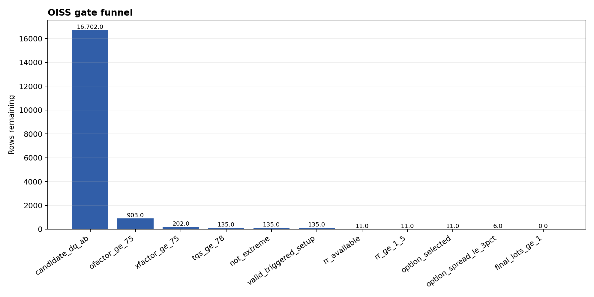
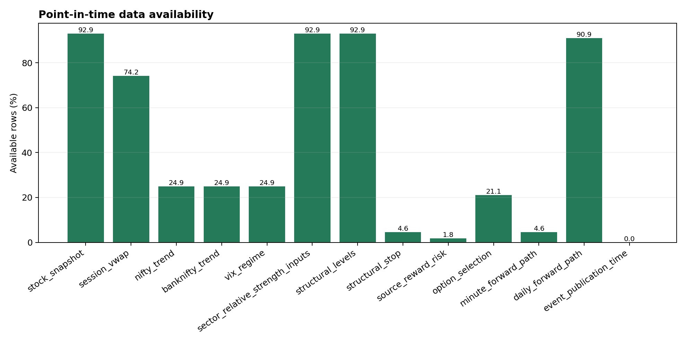
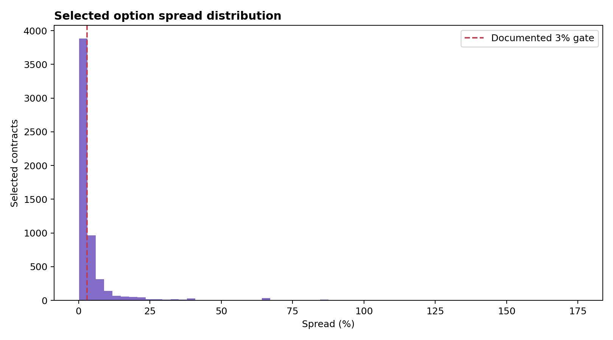
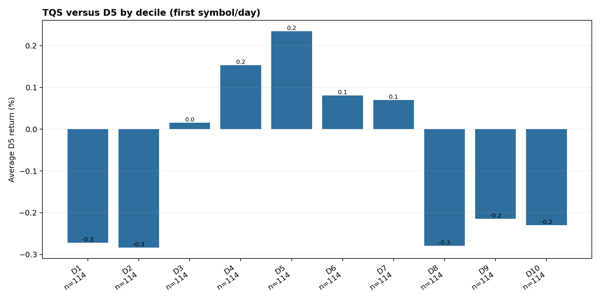

# OISS Evidence Fitness, Gate Attribution and Path Reconstruction

Experiment ID: `OISS-EXPERIMENT-20260826`  
Evaluation date: 26 August 2026  
Production mutation: **none**  
Paper/scheduler state changed: **no**  
Decision verdict: **NO-GO for OISS paper activation**

## 1. Scope and evidence

This is an offline engineering experiment. It does not write to `oiss.*`, change Formula
`FORMULA-OISS-1.202608.0`, change Config `RISK-OISS-1.202608.0`, alter thresholds, enable the
scheduler, or emit paper intents.

Inputs:

- 132 historical runs, 11–25 August 2026.
- 27,456 immutable decision observations across 208 symbols.
- 27,456 separate D1–D5 outcome records.
- 1,160,984 point-in-time one-minute stock bars for the exact 208-symbol universe.
- 18,241 point-in-time NIFTY, BANKNIFTY and INDIA VIX minute bars.
- 183 daily index bars used only for prior-session engineering diagnostics.
- 5,782 persisted selected option records.
- Live database source audit: 215,625 daily bars from 9 January 2023; 1,982,798 August SmartAPI
  option snapshots across 208 underlyings; 11,894,998 August futures-OI snapshots across 626
  instrument tokens.

The raw database extract and all generated tables are in
`output/oiss_experiment_20260826/`. The complete handoff archive described in the companion
reproducibility guide contains them.

## 2. Executive verdict

OISS is a useful evidence framework but its current `BUY NOW` label is not an executable state.
The independent experiment confirms the review findings and adds another execution concern:
10 of the 11 actionable observations did not subsequently touch their recorded planned entry
price during the remaining session. The outcome path therefore cannot be presented as filled-trade
P&L until an explicit fill model exists.

The production-safe state remains:

```text
INTELLIGENCE = ON
SCHEDULER    = OFF
PAPER        = OFF
ASSISTED     = OFF
LIVE         = OFF
```

No formula optimization is justified from 11 trading sessions.

## 3. Gate funnel



| Sequential gate | Rows left | Share of all observations |
| --- | ---: | ---: |
| Candidate DQ A/B | 16,702 | 60.8319% |
| OFactor ≥75 | 903 | 3.2889% |
| XFactor ≥75 | 202 | 0.7357% |
| TQS ≥78 | 135 | 0.4917% |
| Not EXTREME | 135 | 0.4917% |
| Valid triggered setup | 135 | 0.4917% |
| Source R:R available | 11 | 0.0401% |
| Source R:R ≥1.5 | 11 | 0.0401% |
| Option selected | 11 | 0.0401% |
| Correct 3% spread gate | 6 | 0.0219% |
| Final lots ≥1 | **0** | **0%** |

Conclusion: the dominant late-stage bottlenecks are R:R plumbing, option eligibility under the
documented unit, and position sizing—not a lack of OFactor/XFactor candidates.

## 4. Confirmed P0 inconsistencies

| Finding | Independent result | Classification |
| --- | --- | --- |
| Actionable with zero lots | 11/11 BUY NOW observations | RED |
| Actionable inside failed run DQ | 11/11 BUY NOW; 130/132 runs grade F | RED |
| Actionable option gate failure | 5/11 fail the documented 3% spread rule | RED |
| Selected spread above 3% | 1,943/5,782, or 33.61% | RED |
| Every selected option OTM | 5,782/5,782 | RED pending policy confirmation |
| Option risk/unit exceeds premium | 405/805 rows having both values | RED |
| MATURE_D5 lacks mandatory outcome | 1,296 rows | RED |
| Horizon production scores | 27,456/27,456 DATA INSUFFICIENT for all five horizons | RED |
| Run commit known | 0/132 | RED |
| Run image/build digest known | 0/132 | RED |

Code evidence explains the contradictions:

- `main.py:303–314` assigns the canonical decision before option and sizing evidence is final.
- `main.py:387–397` sizes the underlying stop distance using the stock lot.
- `main.py:485–525` selects the option later and merely appends option capital/lot metadata; it
  does not reprice risk or recompute the final decision.
- Config line 16 defines `maximum_spread_pct: 3.0`, while exported `spread_pct` is a decimal ratio.
- `main.py:624` assigns `MATURE_D5` from bar count alone, even when entry-based returns are null.

## 5. Data availability: source failure versus adapter failure



| Input/evidence | Available | Interpretation |
| --- | ---: | --- |
| Stock snapshot | 92.92% | Existing immutable feature source |
| Session VWAP, fresh | 74.19% | 3.38% additional rows stale; 22.43% missing |
| NIFTY/BANKNIFTY/VIX in candidate snapshot | 24.91% | Adapter/snapshot coverage problem |
| Sector + NIFTY 21D inputs | 92.92% | Existing data can materialize sector evidence |
| Prior structural levels | 92.92% | Existing data can support structural R:R |
| Structural stop | 4.56% | Setup/gate plumbing bottleneck |
| Source R:R | 1.76% overall | Calculation/plumbing bottleneck |
| Selected option | 21.06% | Point-in-time chain exists, policy integrity is faulty |
| Minute path with a planned entry | 4.56% | Matches 1,252 valid stop/entry plans |
| Daily forward path | 90.91% | Existing source |
| Historical event publication time | 0% safe | Genuine historical limitation; must remain UNKNOWN |

The database independently proves that index minute bars exist for all 132 scans. The experiment
materialized 132 market-regime rows and 396 index-level rows without future data. Futures OI also
exists in raw form, but its point-in-time underlying mapping and interpretation were not assumed;
that component remains missing in the engineering regime score.

Conclusion:

- **Genuine historical source limitation:** event publication semantics; historical universe
  membership and historical lot-size versions remain unproved.
- **Adapter/calculation limitations:** sector rotation, index context, index levels, structural R:R,
  horizons, and parts of market regime.

## 6. Minute-path reconstruction and fill limitation

The evaluator produced decision-time paths for all 1,252 observations having an entry and stop:

- 15m, 30m, 60m and EOD return.
- MFE/MAE at 15m, 30m, 60m and EOD.
- time to MFE and MAE.
- first T1 and stop timestamps.
- target-first, stop-first, none, and same-minute ambiguity.
- explicit entry-price touch evidence.

Only 902/1,252 planned entry prices were touched after the decision. For the 11 BUY NOW
observations, only **1/11** was touched. Hence every minute output is labelled:

```text
DECISION_TIMESTAMP_USING_PLANNED_ENTRY_NOT_FILL_PRICE
```

These are counterfactual decision paths, not booked or simulated-fill P&L. Before paper activation,
OISS needs setup-specific fill semantics for breakout, pullback, failed bounce and gap-through cases.

The complete table is in both CSV and Zstandard-compressed Parquet:

- `06_minute_path_outcomes.csv`
- `06_minute_path_outcomes.parquet`

## 7. Structural R:R diagnostic

Among 1,252 valid entry/stop plans:

- structural headroom could be constructed for 1,190;
- median structural R:R was 0.453;
- only 214 had structural R:R ≥1.5;
- the original source R:R existed for 484 rows overall, but only 11 after the earlier sequential
  gates.

The experiment uses the nearest valid direction-aware prior-20/session obstacle. This is an
engineering comparison, not a proposed production formula. It demonstrates that a synthetic 1.5R
target and available structural 1.5R are materially different concepts.

## 8. Option selection and sizing integrity



Results for 5,782 selected contracts:

- 1,943 (33.61%) exceed a decimal-ratio `0.03` spread gate.
- all 5,782 are classified OTM.
- all 5,782 pass the persisted 15-minute quote-age requirement.
- 4,029 fall inside absolute delta 0.25–0.65;
- 2,944 fall inside 0.35–0.65;
- 1,706 fall inside 0.45–0.65.
- 405/805 records with a persisted underlying risk/unit have risk/unit greater than the entire
  long-option premium; the same 405 exceed full premium per lot.

This confirms dimensional inconsistency. The correct option risk must be premium loss between the
entry and an option value at the underlying invalidation—not underlying rupees/share multiplied by
the option lot. A conservative versioned premium-loss proxy is acceptable only when point-in-time
repricing cannot be reconstructed.

## 9. Horizon reconstruction

Production result is unambiguous: every BTST, STBT, H2, H3 and H4 state is DATA INSUFFICIENT.
The offline provider-coverage experiment found meaningful existing inputs but no fully populated
mandatory vector:

| Horizon | Average component coverage | Fully complete rows |
| --- | ---: | ---: |
| BTST | 78.33% | 0 |
| STBT | 78.33% | 0 |
| H2 | 64.31% | 0 |
| H3 | 57.17% | 0 |
| H4 | 75.75% | 0 |

The engineering-only available-component scores are for plumbing evaluation only. They were not
written to production and cannot qualify a trade. OI persistence, safe catalyst timestamps,
institutional context and/or regime adapters remain missing depending on the horizon.

## 10. Sector, market and levels

The current production sector table is empty of scores, but the offline adapter constructed 2,374
complete sector/run rows and 2 partial rows across all 132 scans from existing sector returns,
NIFTY returns, stock breadth and signed relative-volume proxies. This proves the problem is largely
materialization, while also showing that a canonical money-flow definition still needs approval.

The market diagnostic reconstructed all 132 runs using only event time ≤ scan time:

- 69 mild bearish;
- 42 neutral/mixed;
- 17 mild bullish;
- 4 strong bullish.

It deliberately omits futures participation and renormalizes only the available 85% weight. It is
therefore marked `INCOMPLETE_NOT_PERSISTED`, not presented as the production OISS regime.

Index levels use prior-session classic pivots and session VWAP solely to prove point-in-time source
fitness. They are not a silent substitute for an approved canonical level algorithm.

## 11. Independent opportunity episodes

Repeated scan observations were collapsed by symbol, trading day, direction and compatible state,
with a 45-minute continuity rule:

| Episode family | Independent episodes | Symbols |
| --- | ---: | ---: |
| ACTIONABLE | 3 | 1 (SWIGGY) |
| NO_CHASE | 18 | 14 |
| DEVELOPING | 6 | 2 |

The 11 BUY NOW rows are therefore three episodes, not 11 independent trades. None is executable
because all have zero final lots. Episode-level EOD numbers are planned-entry diagnostics and are
further limited by entry-touch evidence.

## 12. Score discrimination



Spearman TQS correlations:

| Population | 15m | EOD | D5 | Sample caveat |
| --- | ---: | ---: | ---: | --- |
| Raw scan observations | 0.004 | 0.086 | −0.002 | repeated scans |
| First symbol/day | 0.136 | 0.115 | −0.015 | only 49 intraday paths |
| Opportunity episodes | −0.064 | −0.455 | −0.229 | only 21 intraday / 16 D5 episodes |

This does not prove TQS is ineffective. It proves the available independent sample is too small and
does not support threshold optimization. `14_threshold_sensitivity.csv` is explicitly marked
`SENSITIVITY_ONLY_NOT_OPTIMIZATION`; no “best” threshold is selected.

## 13. No-chase diagnostic

No-chase remains worth preserving:

| Population | N | Avg 15m | Avg EOD | Avg D1 | Avg D5 | Avg EOD MAE |
| --- | ---: | ---: | ---: | ---: | ---: | ---: |
| Raw no-chase scans | 53 | −0.249% | −0.418% | −0.965% | −2.092% | −1.028% |
| First no-chase per symbol/day | 14 | −0.198% | +0.014% | −0.428% | −2.019% | −1.152% |
| No-chase episodes | 18 | −0.199% | −0.017% | −0.681% | −2.183% | −1.043% |

This is direction-normalized and still a small, concentrated sample. It is supportive evidence, not
a validation claim.

## 14. Fitness classification

| OISS section | Grade | Reason |
| --- | --- | --- |
| Immutable run/candidate linkage | GREEN | complete IDs and point-in-time timestamps |
| OFactor/XFactor/TQS research fields | AMBER | populated, but no validated forward discrimination yet |
| Extension/no-chase | AMBER | protective signal in small sample |
| Data-quality semantics | RED | failed run DQ coexists with actionability |
| Signal/execution/final status | RED | collapsed state causes impossible BUY NOW outcomes |
| Entry/fill semantics | RED | 10/11 actionable planned entries not touched after decision |
| Structural R:R | RED | absent for dominant funnel and synthetic target is not headroom |
| Option spread gate | RED | percentage-unit mismatch confirmed |
| Option selection | RED | 100% OTM; policy/ranking integrity unproved |
| Option position sizing | RED | underlying and option units mixed |
| Daily maturity | RED | 1,296 false-complete MATURE_D5 rows |
| Minute-path source | GREEN | exact bars cover all 208 symbols; evaluator works |
| Minute-path execution interpretation | AMBER | decision paths available, fill model absent |
| Sector data fitness | GREEN | 92.92% inputs and 2,374 complete offline rows |
| Production sector materialization | RED | current persisted components empty |
| Index source fitness | GREEN | all three indices available for all run timestamps |
| Production market regime/levels | RED | incomplete/not persisted |
| Horizon input fitness | AMBER | 57–78% average component coverage |
| Production horizons | RED | every state DATA INSUFFICIENT |
| Historical event risk | GREY | safe publication-time evidence unavailable |
| Historical universe/lot versions | GREY | point-in-time versions unavailable |
| Run provenance | RED | 0/132 commit and image digests known |
| Portfolio risk/position management | RED | incomplete and not paper-tested |

## 15. Answers to the ten experiment questions

1. **Genuinely unavailable:** historical event publication semantics, point-in-time universe and lot
   history. Futures mapping is unverified, not absent.
2. **Missing OISS plumbing:** sector rotation, most market context, index levels, structural R:R,
   horizons, final execution gate and provenance.
3. **Largest viable-candidate eliminator:** source R:R availability (135 to 11), then corrected
   option spread (11 to 6), then sizing (6 to 0).
4. **Inconsistent statuses:** yes—11 zero-lot BUY NOW; all occur in run DQ F; five fail the 3% spread
   rule; ten lack a subsequent planned-entry touch.
5. **Score discrimination:** not established; correlations are near zero or unstable in small
   episode samples.
6. **No-chase:** directionally protective in this sample, especially D5, but not validated.
7. **Working option criteria:** quote age, OI and volume are populated. Spread units and contract
   ranking are not reliable; 100% OTM requires explanation.
8. **Sizing units correct:** no; 405/805 directly comparable rows exceed the long-option premium.
9. **Horizons calculable:** many components can now be derived, but no horizon has a complete safe
   mandatory vector; production qualification must remain unavailable.
10. **Before paper:** fix state separation, DQ gate, fill model, R:R, spread units, option repricing,
    maturity, provenance, portfolio risk, position management and then complete a scheduler-on,
    paper-off shadow period.

## 16. Required correction order and activation gate

1. Persist `signal_state`, `execution_state`, `final_state`.
2. Make run/candidate DQ hard-gate semantics explicit.
3. Prevent actionable final state when lots are zero, the option is invalid or no fill exists.
4. Standardize ratios and test 0.0299/0.0300/0.0301.
5. Reprice long-option loss in premium units.
6. Require mandatory D1–D5 values before `MATURE_D5`.
7. Persist commit, image digest, config hash and engine version.
8. Materialize structural R:R, sector, market, levels and horizons from approved adapters.
9. Backtest independent episodes with fill-aware minute paths.
10. Enable scheduler with paper still off and reconcile at least 20 sessions; review again at 60.

Paper remains **NO-GO** until these conditions pass fixture, point-in-time, idempotency, restart,
portfolio-risk and shadow-scan reconciliation tests.
