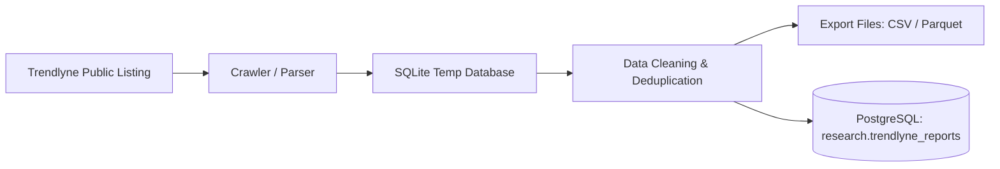

# 📈 Trendlyne Research Reports Scraper

[](https://www.python.org/)
[](https://www.docker.com/)
[](https://www.postgresql.org/)
[](LICENSE)

A robust, production-ready, checkpointed scraper for publicly available analyst research reports from [Trendlyne](https://trendlyne.com/research-reports/all/). It systematically captures analyst recommendations, target prices, stock details, and returns potential, with built-in **NIFTY 100 filtering**, multi-format export (**CSV**, **Parquet**, **SQLite**), and optional automated upsert into **PostgreSQL**.

---

## ✨ Features

- 🔄 **Resumable & Checkpointed**: Automatically saves progress page-by-page. Can be stopped and resumed anytime without duplicate requests.
- 🎯 **NIFTY 100 Filter (Default)**: Dynamically fetches and caches the official NSE NIFTY 100 universe to prioritize high-liquidity stocks.
- 📦 **Docker & Compose Ready**: Fully containerized with persistent volumes for data, logs, and checkpoints.
- 🗄️ **PostgreSQL Integration**: Incremental mode inserts only previously unseen `report_id` values into `research.trendlyne_reports`; existing rows remain unchanged.
- ⏰ **Durable Scheduler**: Runs once at container startup and at 07:00 Asia/Kolkata on weekdays by default.
- 🔔 **New-Report Webhook**: A durable outbox sends only records that PostgreSQL actually inserted and retries failed delivery on the next run.
- 📊 **Multi-Format Export**: Generates cleaned `CSV` (standard & full layouts), `Parquet`, and local `SQLite` databases.
- 🛡️ **Polite & Fault-Tolerant**: Configurable rate limits, User-Agent rotation, and exponential backoff retry strategies.
- 🔍 **Optional Stock Enrichment**: Best-effort enrichment for sector, industry, market cap, BSE symbol, and ISIN.

---

## 🏛️ Architecture & Pipeline Flow



---

## 🚀 Quick Start

### 1. Using Docker & Docker Compose (Recommended)

#### Prerequisites
- [Docker Desktop](https://www.docker.com/products/docker-desktop/) installed and running.

#### Setup & Execution
1. Clone the repository:
   ```bash
   git clone https://github.com/Nifty-50/trendlyne_scraper.git
   cd trendlyne_scraper
   ```

2. Configure environment variables:
   ```bash
   cp .env.example .env
   ```
   *(Update your PostgreSQL credentials in `.env` if DB persistence is desired)*

3. Run the container:
   ```bash
   docker-compose up --build
   ```

Outputs will be saved directly into your local `./data` and `./logs` directories.

The container runs `scheduler.py` by default. Its normal schedule is a startup
cycle plus Monday-Friday at 07:00 IST. Use `python incremental.py` when a single
incremental cycle is needed without the scheduler.

---

### 2. Local Python Installation

#### Prerequisites
- Python 3.10+ installed.

#### Setup
```bash
# Clone the repository
git clone https://github.com/Nifty-50/trendlyne_scraper.git
cd trendlyne_scraper

# Create and activate virtual environment
python -m venv venv
# Windows:
venv\Scripts\activate
# Linux/macOS:
source venv/bin/activate

# Install dependencies
pip install -r requirements.txt

# Configure environment
cp .env.example .env
```

---

## 💻 CLI Usage

```bash
# Standard crawl (Last 5 years, NIFTY 100 stocks only, with PostgreSQL persistence)
python main.py

# Override lookback period (e.g., last 2 years)
python main.py --years 2

# Crawl all stocks (disable NIFTY 100 constituent filtering)
python main.py --all-stocks

# Quick test run (cap at 50 pages)
python main.py --max-pages 50

# Run with stock overview enrichment (Sector, Industry, Market Cap, ISIN)
python main.py --enrich

# Use a custom stock universe file
python main.py --symbols-file my_stocks.csv

# Run without PostgreSQL persistence (CSV/Parquet/SQLite only)
python main.py --no-postgres

# Verify PostgreSQL connection and schema before running
python main.py --check-postgres

# Force-refresh the cached NIFTY 100 constituent list from NSE
python main.py --refresh-nifty100

# Ignore existing checkpoints and start a fresh crawl
python main.py --no-resume
```

---

## 🗄️ PostgreSQL Database Setup

The scraper can automatically mirror all cleaned and validated records into PostgreSQL.

### 1. Configuration in `.env`
```ini
POSTGRES_ENABLED=true
DB_HOST=127.0.0.1
DB_PORT=5432
DB_NAME=tradingdb
DB_USER=trader
DB_PASSWORD=your_secure_password
```

### 2. Table Schema
Ensure the target table exists in your PostgreSQL database:

```sql
CREATE SCHEMA IF NOT EXISTS research;

CREATE TABLE IF NOT EXISTS research.trendlyne_reports (
    report_id VARCHAR(255) PRIMARY KEY,
    report_date DATE,
    published_date DATE,
    report_time VARCHAR(50),
    scraped_timestamp TIMESTAMPTZ,
    stock_name VARCHAR(255),
    company_name VARCHAR(255),
    nse_symbol VARCHAR(50),
    bse_symbol VARCHAR(50),
    isin VARCHAR(50),
    sector VARCHAR(255),
    industry VARCHAR(255),
    market_cap VARCHAR(100),
    broker_name VARCHAR(255),
    research_house VARCHAR(255),
    analyst_name VARCHAR(255),
    recommendation VARCHAR(50),
    previous_recommendation VARCHAR(50),
    upgrade_downgrade VARCHAR(50),
    rating_change INT,
    target_change INT,
    recommendation_strength VARCHAR(50),
    cmp NUMERIC,
    price_at_recommendation NUMERIC,
    target_price NUMERIC,
    previous_target NUMERIC,
    upside_pct NUMERIC,
    downside_pct NUMERIC,
    absolute_gain_potential NUMERIC,
    report_title TEXT,
    summary TEXT,
    description TEXT,
    notes TEXT,
    tags TEXT,
    report_url TEXT,
    pdf_url TEXT,
    exchange VARCHAR(20),
    currency VARCHAR(20),
    source VARCHAR(50)
);
```

To test connectivity anytime:
```bash
python main.py --check-postgres
```

---

## 📂 Project Structure

```
trendlyne_scraper/
├── Dockerfile                  # Container build recipe
├── docker-compose.yml          # Container orchestration & volume mounts
├── requirements.txt            # Python package dependencies
├── .env.example                # Environment variables template
├── .dockerignore               # Files excluded from Docker context
├── .gitignore                  # Files excluded from git tracking
├── main.py                     # CLI entrypoint & pipeline orchestration
├── incremental.py              # Insert-only incremental crawl cycle
├── incremental_storage.py      # Advisory lock, run ledger, insert-only DB/outbox
├── scheduler.py                # Startup + weekday 07:00 IST scheduler
├── webhook.py                  # New-record-only webhook delivery
├── healthcheck.py              # Scheduler heartbeat health check
├── crawler.py                  # HTTP session, rate limiting & pagination
├── parser.py                   # HTML parsing & field extraction
├── database.py                 # SQLite local store (checkpoint & dedup)
├── postgres.py                 # PostgreSQL persistence & upsert layer
├── exporter.py                 # Data cleaning, validation & file export
├── models.py                   # Data models & schema definitions
├── nifty100.py                 # NSE NIFTY 100 resolver & caching
├── utils.py                    # Logging, retries & string helpers
├── config.py                   # Central settings management
├── checkpoints/                # Resume checkpoint store (gitignored)
├── data/                       # Output CSV, Parquet, and SQLite files (gitignored)
├── logs/                       # Execution and crawler logs (gitignored)
└── state/                      # Scheduler heartbeat/state (gitignored)
```

---

## 📋 Scraped Fields Coverage

| Field | Source | Description |
|---|---|---|
| `report_id` | Derived | Unique identifier extracted from report slug/ID |
| `report_date` / `published_date` | Scraped | Normalized publication date (`YYYY-MM-DD`) |
| `stock_name` / `company_name` | Scraped | Stock name as listed |
| `nse_symbol` | Scraped | NSE trading symbol |
| `broker_name` / `research_house` | Scraped | Publishing brokerage/firm |
| `recommendation` | Scraped | Stated stance (e.g., `Buy`, `Hold`, `Accumulate`, `Sell`) |
| `rating_change` / `target_change`| Scraped | Flags indicating recommendation or target adjustments |
| `cmp` | Scraped | Current Market Price (LTP) at crawl time |
| `price_at_recommendation` | Scraped | Stock price at the time of report release |
| `target_price` | Scraped | Target price forecasted by the analyst |
| `upside_pct` / `downside_pct` | Scraped/Derived | Forecasted upside or downside percentage |
| `absolute_gain_potential` | Derived | Nominal price gap (`target_price - price_at_recommendation`) |
| `report_title` / `summary` | Scraped | Report headline and thesis snippet |
| `report_url` | Scraped | Canonical Trendlyne post URL |
| `pdf_url` | Scraped (Raw) | Direct document URL in markup |
| `sector` / `industry` / `market_cap` / `isin` | Scraped (`--enrich`) | Overview fields fetched during optional enrichment |

---

## ⏰ Automated Incremental Crawling

`docker compose up -d --build` starts a long-running scheduler. By default it:

1. runs one incremental cycle at container startup;
2. runs at 07:00 Asia/Kolkata every Monday-Friday;
3. locks execution in PostgreSQL so overlapping containers cannot write twice;
4. inserts with `ON CONFLICT (report_id) DO NOTHING`;
5. retains all existing rows without updating or deleting them; and
6. queues a webhook only for rows returned by PostgreSQL as newly inserted.

The overlap window is deliberately re-read on each run to catch late-published
reports. Database IDs, not page position or an old checkpoint, are authoritative
for deduplication. See `.env.example` for schedule, overlap and webhook controls.

---

## ⚖️ Disclaimer & Politeness Policy

This scraper is designed strictly for **publicly accessible listing pages**.
- It does **not** bypass login walls or authentication.
- It does **not** download gated PDF documents.
- It respects rate limits and site performance with built-in throttles and backoffs.
- For high-volume or raw PDF access, refer to Trendlyne's official [Data Downloader](https://trendlyne.com/tools/data-downloader/stock-data-downloader/) or commercial data licenses.
